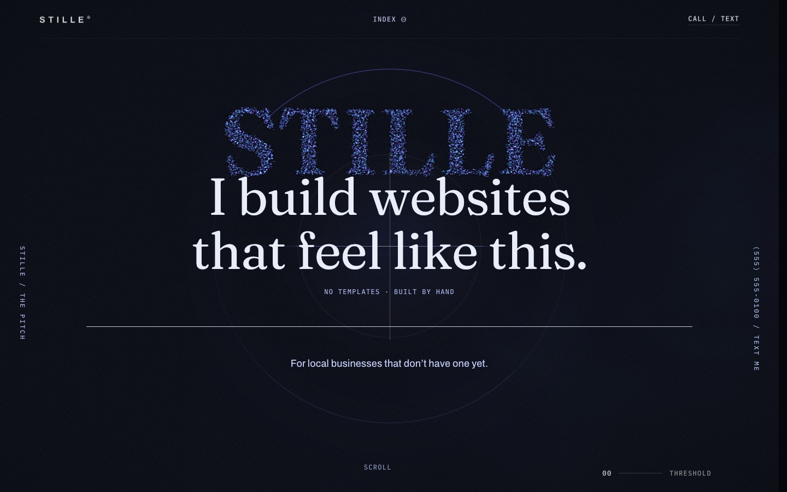

# STILLE

A fully animated one-page website I designed and built to pitch my web design work to local businesses: proof that a small business site can feel like a high-end product launch.

**Live site → [stillebuilds.netlify.app](https://stillebuilds.netlify.app)**



## What's in it

- **One continuous signal line** runs the length of the page. It starts as a flatline, turns into a waveform, and ends as the underline of the call-to-action.
- **A 12,000-particle WebGL field** (three.js) that forms the STILLE wordmark, then scatters as you scroll.
- **Aurora shader curtains and a film-grain layer** for depth, plus scroll-velocity effects: type skews and splits color when you scroll fast.
- **Scroll-told story** built on GSAP ScrollTrigger and Lenis smooth scrolling. Sections pin, scrub and hand off to each other.
- **A daylight passage** mid-page where the whole palette flips from night to day and back.
- **Accessibility:** respects `prefers-reduced-motion`, has a keyboard-navigable section index, and keeps text contrast readable in every section.

## Built with

Vite · three.js · GSAP + ScrollTrigger · Lenis · plain JavaScript and CSS, no framework. The production JavaScript is about 90 kB gzipped.

## Run it

```bash
npm install
npm run dev      # http://localhost:5173
npm run build    # production build in dist/
```

The contact number is injected at build time from `.env`, which ships with a fictional 555 placeholder. A real number goes in `.env.local`, which is gitignored.

## How I built it

I built this with AI coding agents, mainly [Claude Code](https://claude.com/claude-code). I set the creative direction and design references, made the call on every section, and tested each change by hand in real browsers, reporting what looked or felt off. The AI wrote most of the code. Commits are co-authored, so the history shows how it came together.
